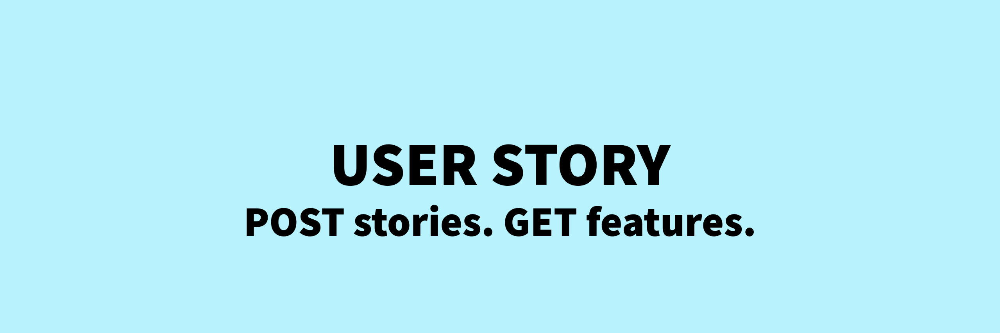
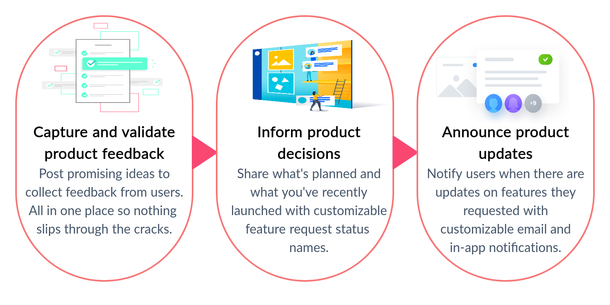

# User Story - Improvements and New features

## Introduction

The goal of **User Story** is to design and present a scalable backend infrastructure that delivers a web interface allowing users to request new features and give feedback in an easy and intuitive way. Users can attach files with their story to explain what they want. The admins can then resolve, close and update the status of these stories. Users can interact with other stories via comments and votes. This can also serve as an efficient feedback and response mechanism which is critical for any organization to improve and make progress. Simply put, its a **product management tool**.

## How it works

## My Journey

It was a great experience, contributing to an open-source project and learning something new everyday in that process. Given below you can find the blogs written by me, documenting my GSoC 2021 journey.

[GSoC 2021 Technical blogs](https://blogs.python-gsoc.org/en/sundeepchands-blog/)

## My contributions

- Wrote a script to automate the backend server setup and seed the database for testing.
- Setup CI/CD pipelines with Github Actions for the front-end and back-end repositories.
- Implemented searching of stories, product templates and user profile picture upload features.
- Cloudinary integration to support file attachments feature.
- Updated Cypress tests.
- Integrated Google Authentication to enable Single Sign-On. (In review)
- Updated UI for Home, Profile and MyStories pages. (In review)

## My code contributions

- [Link to PRs in front-end client repository](https://github.com/EOS-uiux-Solutions/user-story/pulls?q=is%3Apr+author%3ASundeepChand+)
- [Link to PRs in back-end repository](https://github.com/EOS-uiux-Solutions/strapi/pulls?q=is%3Apr+author%3ASundeepChand+)

## Future Improvements

- Integration of User Story with tools in our existing workflow like Slack and Github.
- Personalized e-mail notifications.
- Migration to TypeScript to add strict type checking.
- Quick chats and meetings for users and admins to plan and discuss ideas and stories.
- Enable admins to go live via the platform to interact with users and understand their needs.

## Thank You!

The past 4 months have been pretty exciting, full of ups and downs. Time flew by so fast, and today here I am writing this final report. All these things would not have been possible without your support, motivation and guidance. Thank You for guiding me through this summer.